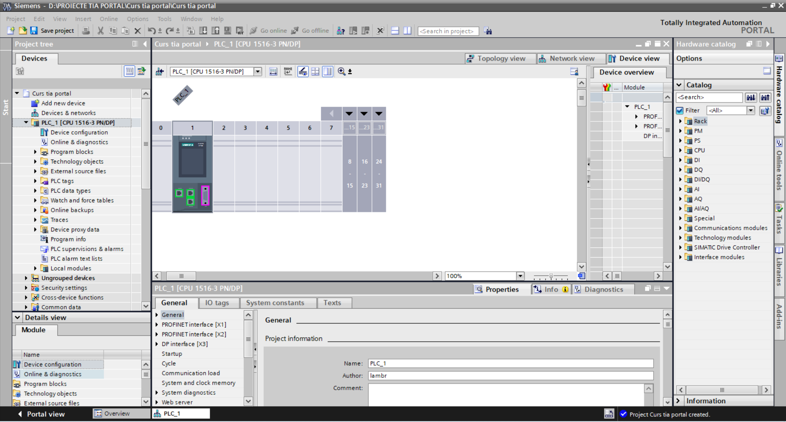
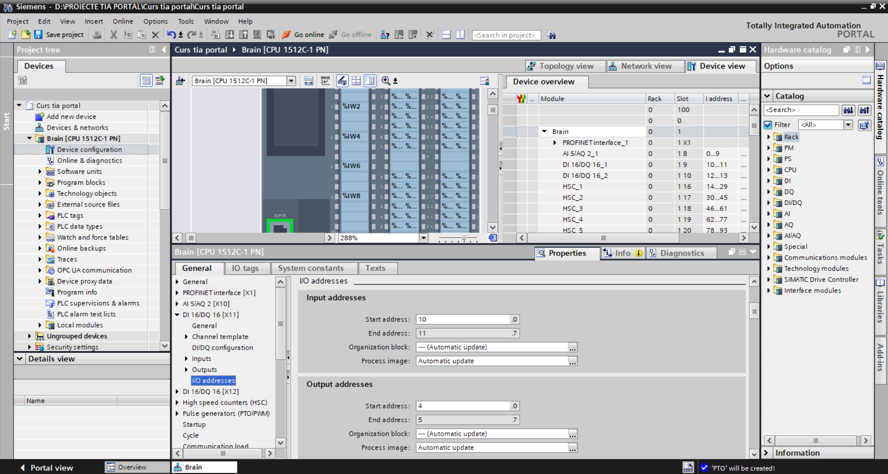
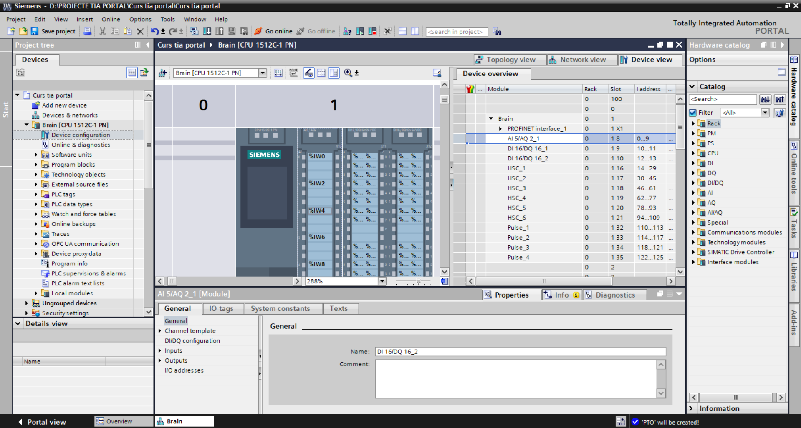
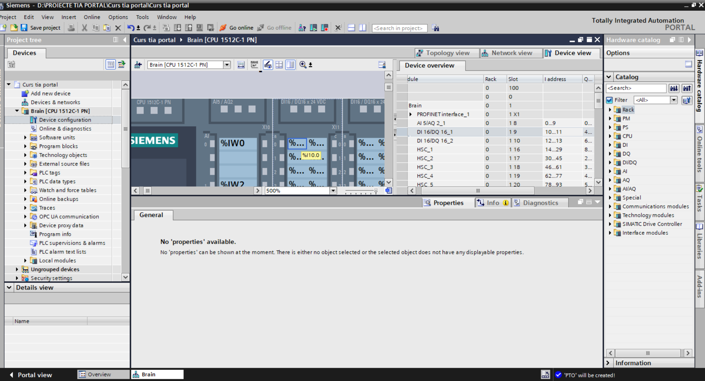
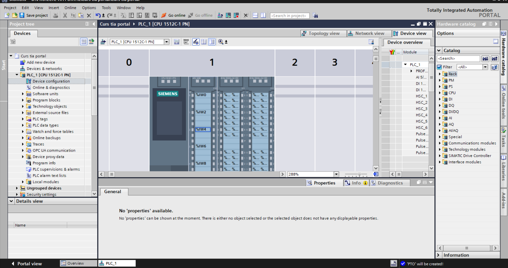
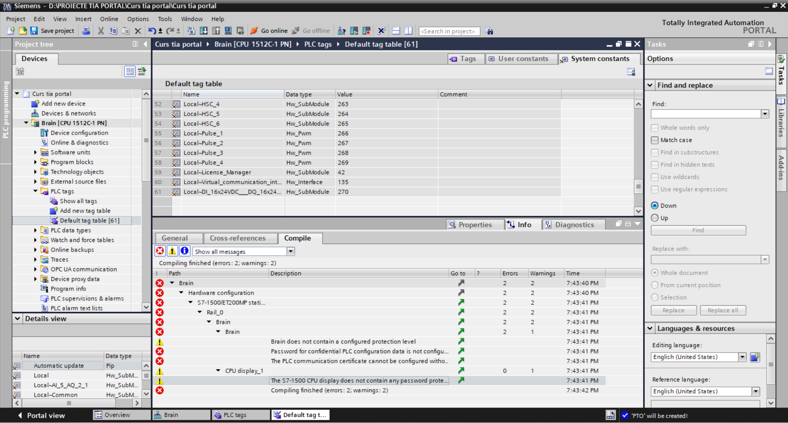
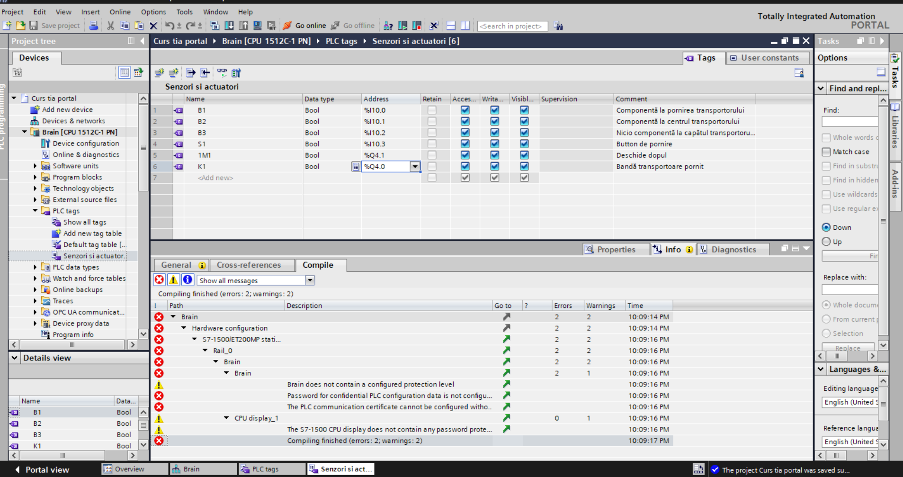
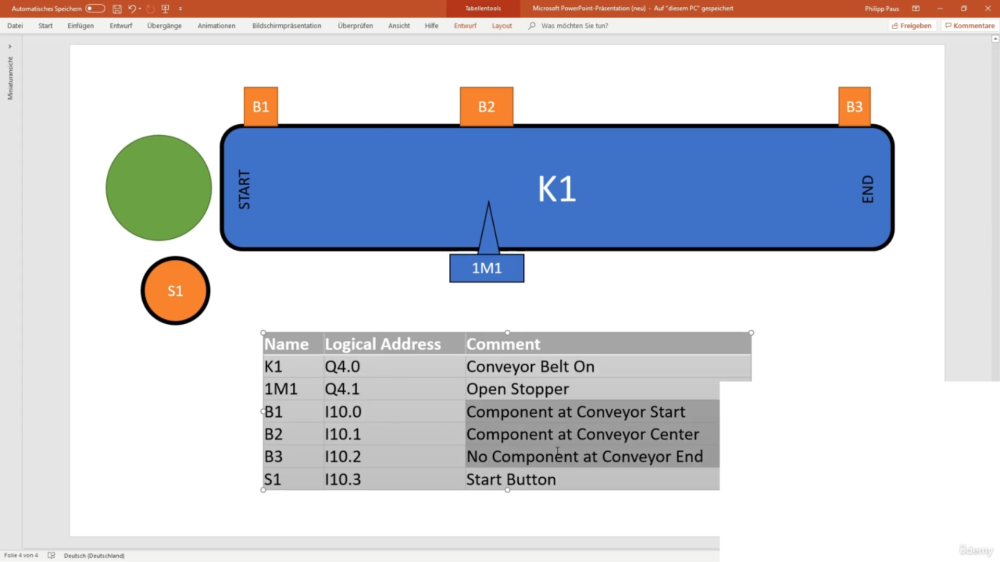

# 📘 Lesson 01 – Introduction to TIA Portal & Basic Configuration

## 🔹 Overview

In this lesson, I explored the basics of Siemens TIA Portal, focusing on the initial setup and fundamental concepts required to start working with PLC programming.

---

## 🔹 1. TIA Portal Installation

This step involves downloading and installing Siemens TIA Portal.

⚠️ *Note:* This step was skipped in practice since TIA Portal was already installed on my system.

---

## 🔹 2. Hardware Configuration

In this section, I learned how to:

* Create a new project in TIA Portal
* Add and configure a PLC
* Understand the hardware layout

📸 Example:

---

## 🔹 3. PLC Properties

I explored the PLC properties and settings, including:

* Device configuration
* System parameters
* General PLC information

📸 Example:

---

## 🔹 4. Digital Inputs (Sensors)

Introduction to digital inputs and how sensors are connected to the PLC.

Example:

* Sensor connected to input **I10.0**

📸 Example:

📸 Sensor Example:

---

## 🔹 5. PLC Tags

Understanding how to define and use tags in TIA Portal:

* Assigning names to inputs/outputs
* Making code easier to read and maintain

📸 Example:

---

## 🔹 6. Constants and Advanced Tags

I learned how to:

* Use constants
* Organize tags efficiently

📸 Examples:

---

## 🔹 7. Automation Example

Basic overview of a simple automation system:

* Conveyor belt control
* Sensors (B1, B2, B3)
* Start button (S1)
* Outputs (K1, 1M1)

📸 Example:

---

## 🔹 Conclusion

This lesson provided a solid foundation in:

* Navigating TIA Portal
* Configuring hardware
* Working with PLC tags
* Understanding basic automation components

---

## 🔹 Next Steps

* Ladder Logic basics
* NO/NC contacts
* First PLC program

---
