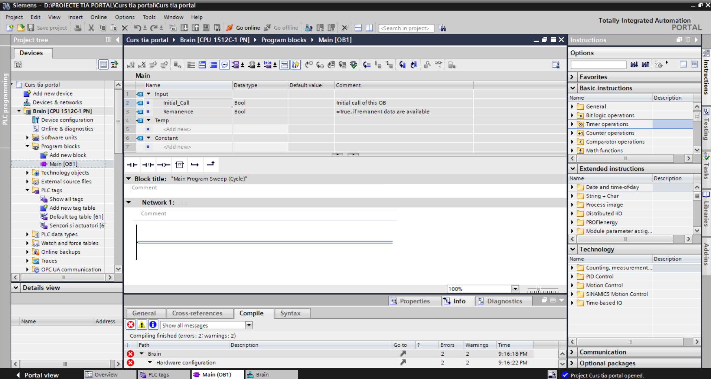
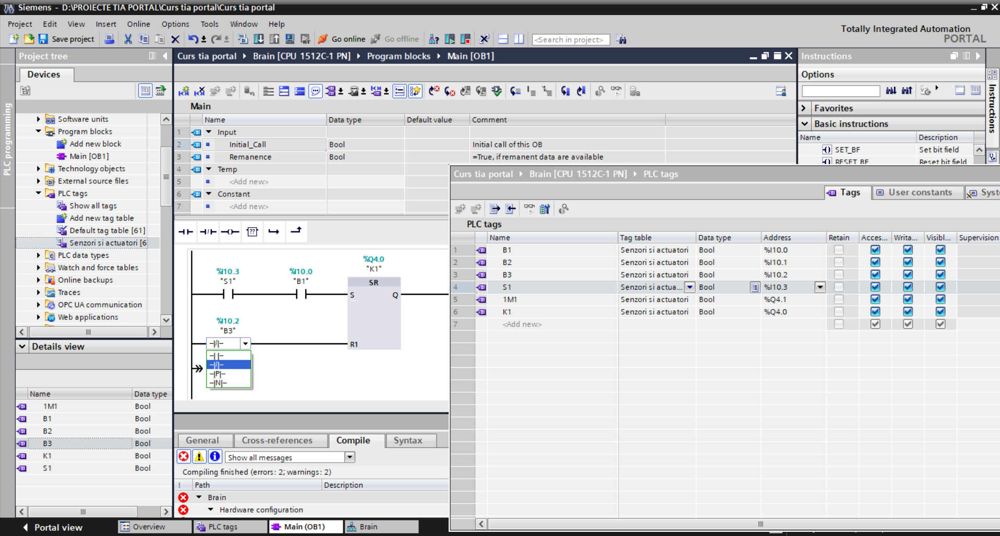
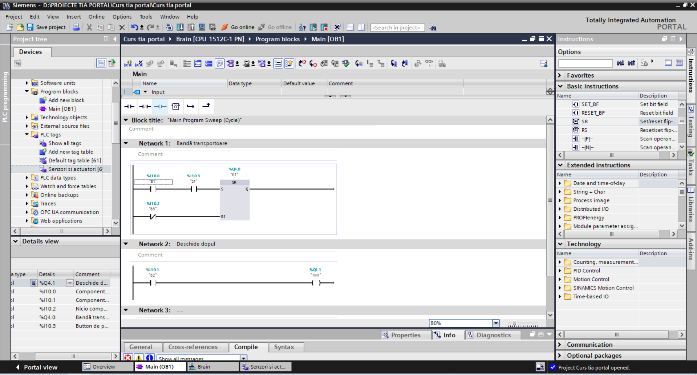
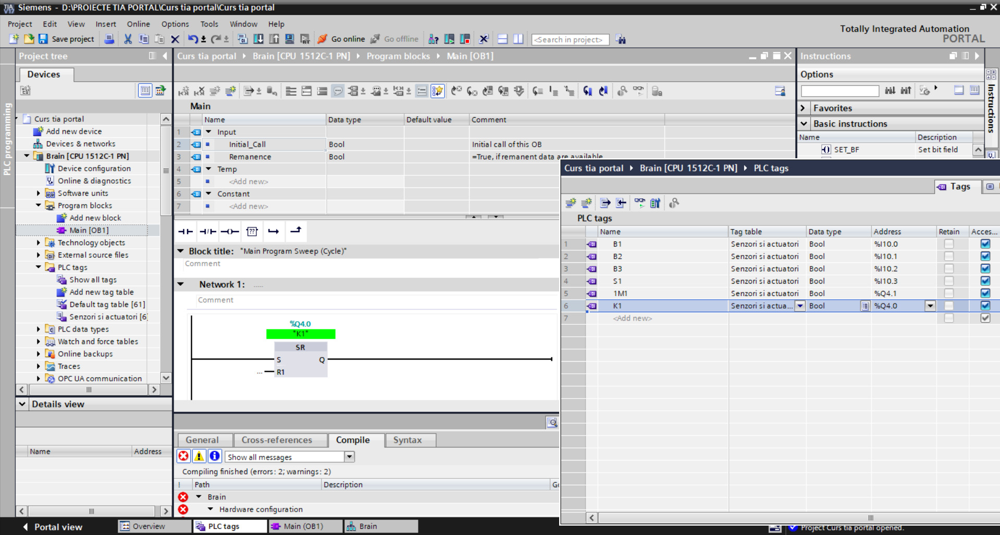

# 📘 Lesson 02 – Bit Logic Operations & First PLC Program (TIA Portal)

## 🔹 Overview

In this lesson, I moved from basic configuration to actual PLC programming using **bit logic operations** in Siemens TIA Portal.

The focus was on understanding how digital signals (bits) interact and how to control outputs based on logical conditions.

---

## 🔹 1. Main Program (OB1)

I worked inside the main program block **OB1**, where the PLC executes logic cyclically.

* Every scan cycle reads inputs
* Executes logic
* Updates outputs

📸 Example:

---

## 🔹 2. Bit Logic Operations

I learned the fundamental logic operations used in PLC programming:

* **AND** → All conditions must be TRUE
* **OR** → At least one condition must be TRUE
* **NOT** → Inverts the signal

These operations are the foundation of all automation logic.

📸 Example:

---

## 🔹 3. Practical Logic Implementation

I implemented simple control logic using inputs and outputs:

* Buttons used as inputs (simulation)
* Outputs activated based on logic conditions
* Tested behavior in simulation mode

📸 Example:

---

## 🔹 4. Working with Tags (Including FLOAT)

I explored different types of tags:

* **BOOL** → for digital signals (0 / 1)
* **FLOAT** → for analog values

Even though this lesson focused mainly on digital logic, I introduced FLOAT tags for future use in analog processing.

📸 Example:

---

## 🔹 5. Simulation Testing

Using the simulator, I:

* Assigned buttons to inputs
* Triggered different logic conditions
* Observed how outputs respond in real time

This helped me understand how PLC logic behaves in real scenarios.

---

## 🔹 Key Takeaways

* PLC runs logic in cycles (scan cycle)
* Bit logic is the core of automation
* Inputs control outputs through logical conditions
* Simulation is essential for testing before real hardware

---

## 🔹 Next Steps

* Latching (SET/RESET) logic
* Timers (TON, TOF)
* More complex automation scenarios

---
